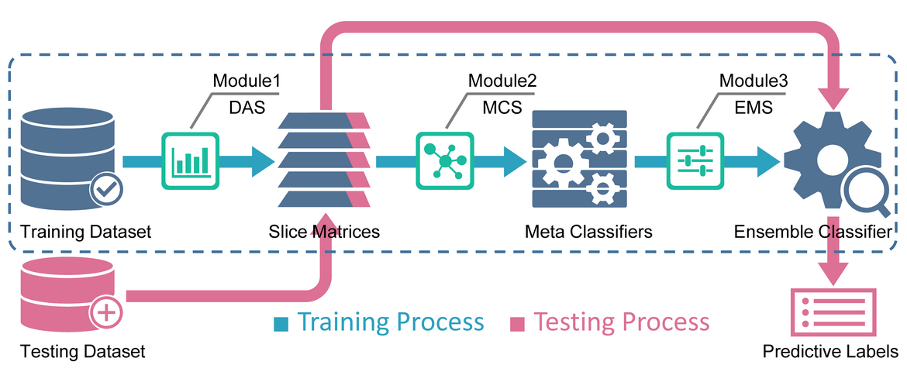
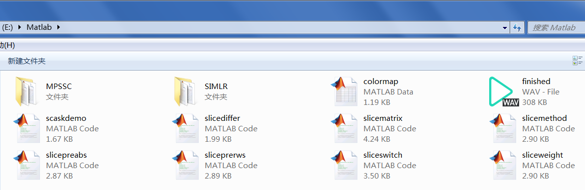
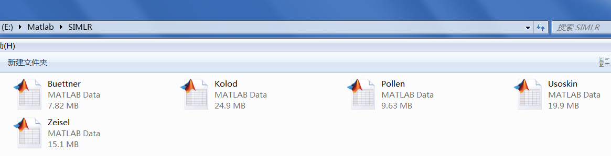
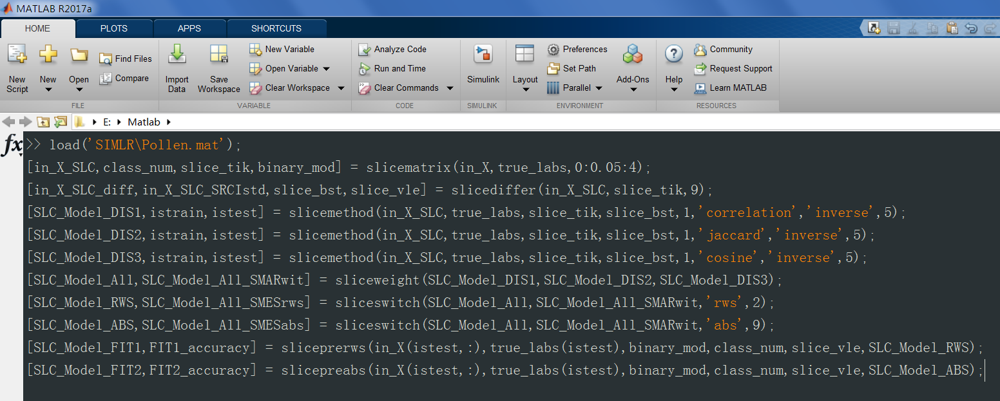

# scASKcmd v1.0
The command line version of the scASK.  Availability: https://github.com/liubo2358/scASKcmd  
*Note:* In present period, the scASKcmd is only for reproducing the results of the paper. Please contact the corresponding author (xfzou AT whu.edu.cn) if you have further questions about scASKcmd.

# Introduction

The scASK is a novel and robust ensemble framework that is especially suited for cell type classification based on scRNA-seq data. Furthermore, scASK is also a generic ensemble classifier for any supervised classification problem, such as classifying cancer types based on gene expression data or DNA methylation data. scASKcmd is the command line version of scASK in a batch-processing manner, which can perform the whole process without intervention.   
  

# Example datasets

1. `SIMLR dataset` https://github.com/BatzoglouLabSU/SIMLR/tree/SIMLR/MATLAB/data `[77.4mb]`
2. `MPSSC dataset` https://github.com/ishspsy/project/tree/master/MPSSC/Data `[93.3mb]`

# Quick guide for running scASKcmd

Step1: Unzip all of the files in `scASKcmd-master.zip` to the current working directory of Matlab  
  

Step2: Download example datasets, then copy the mat-files to the corresponding data directory  
  

Step3: Enter the corresponding statements in Command Window, scASK will be launching soon  
  

# Supplementary materials

1. The complete running parameters and output figures for each example dataset can be found in [`Supplementary.pdf`](./Supplementary/Supplementary.pdf "Supplementary.pdf") `[10.6mb]`
2. The dynamic demonstration for implementing cell type classification using scASKcmd can be found in [`Demonstration.wmv`](./Supplementary/Demonstration.wmv "Demonstration.wmv") `[10.1mb]`

# Author's remarks

1. scASKcmd is developed with Matlab 2017a and compatible with later releases
2. dataset should be ready before running the scASKcmd
3. the GUI version of the scASK is publicly available at https://github.com/liubo2358/scASKapp
