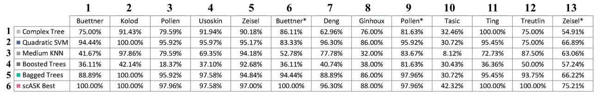

We have added the scripts of five baseline methods (Complex Tree, Quadratic SVM, Medium KNN, Bagged Tree and Boosted Tree) running on all 13 real single-cell datasets (listed in Table I) in github repository. These scripts correspond to Fig.6 in the manuscript. In order to ensure the completeness and exactness of these competitor algorithms, we directly use the built-in classification learner of Matlab 2017a to import data, implement algorithms and output results. The data partitioning for each dataset is exactly the same as scASK, and without any data preprocessing. As commercial software, these built-in algorithms have been highly tuned, so we have not changed their default parameters. The trainClassifiers calling by figure6.m in the github repository are directly output by the source code of classification learner, which is convenient for reviewers to reproduce the results of our manuscript.

  
