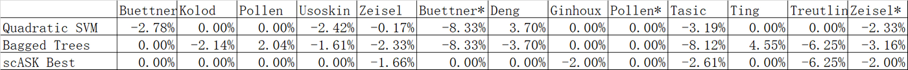

We simulate missing values by randomly replacing the non-zero elements of the original data with zeros for a certain proportion (10%) on thirteen real scRNA-seq datasets. The variations of prediction accuracy before  (figure6) and after(figure7) the simulations are used for measuring the robustness of the algorithms. 

  
